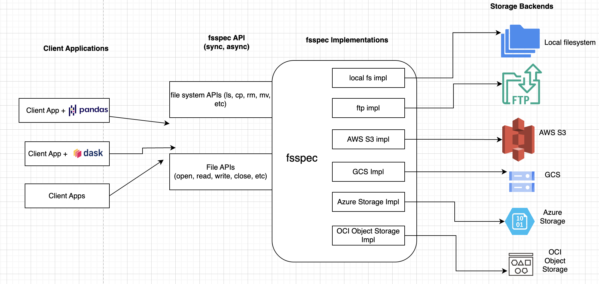

# What is fsspec
- Filesystem Spec (fsspec) is an open source project to provide a unified pythonic interface to local, remote and embedded file systems and bytes storage.
- Provides a uniform and familiar API irrespective of the storage backend
- Irons out the quirks specific to each implementation, so clients just need to provide credentials for each service
- Provides 2 sets of APIs
  - a set of filesystem classes with uniform APIs (such as ls, cp, rm, cat, mkdir, …).
  - top-level convenience functions like fsspec.open(), to allow you to quickly get from a URL to a file-like object that you can use with a third-party library or your own code

# Interfaces Implemented
| Class       | Interface     | Description                                           |
|-------------|---------------|-------------------------------------------------------|
| `OCIObjectStorageFileSystem`     | `AbstractFileSystem`   | An abstract super-class for pythonic file-systems.    |
| `OCIObjectStorageFile`        | `AbstractBufferedFile` | Convenient class to derive from to provide buffering. |
| `OCIObjectStorageFileSystemAsync`      | `AsyncFileSystem`      | Asynchronous implementations of filesystem interfaces |

# File Upload Design
## Single-file upload

## Multi-part Upload
